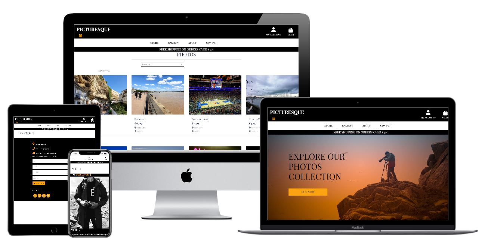
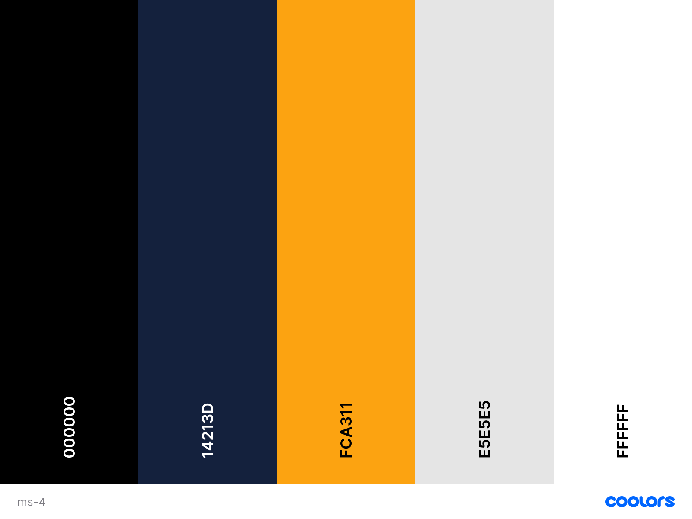

This full-stack website represents the last milestone project I designed at Code Institute Full Stack Development course, specifically the Full Stack Frameworks with Django.

## Table of Contents

- [Website](#website)
- [The Goal of This Website](#the-goal-of-this-website)
- [Front-End Design](#front-end-design)
- [Wireframes](#wireframes)
- [UX](#ux)
  * [Project Target Audience](#project-target-audience)
  * [Business goals](#business-goals)
  * [Exploring Photos and Navigation](#exploring-photos-and-navigation)
  * [Sorting and Searching](#sorting-and-searching)
  * [Purchasing and Checkout](#purchasing-and-checkout)
  * [Registration and User Accounts](#registration-and-user-accounts)
  * [Administration and Picturesque Store Management](#administration-and-picturesque-store-management)
- [Utilised Technologies](#utilised-technologies)
- [Testing](#testing)
  * [Automated Testing](#automated-testing)
  * [Manual Testing](#manual-testing)
    + [Responsiveness](#responsiveness)
    + [Navbar](#navbar)
    + [Home Page](#home-page)
    + [Store Page](#store-page)
    + [Gallery Page](#gallery-page)
    + [Photo Detail Page](#photo-detail-page)
    + [Photo Bag Page](#photo-bag-page)
    + [Checkout and checkout success pages](#checkout-and-checkout-success-pages)
    + [Authentication Pages](#authentication-pages)
    + [Profile and Order History](#profile-and-order-history)
    + [Admin Picturesque Management functionality](#admin-picturesque-management-functionality)
    + [About Page](#about-page)
    + [Contact Page](#contact-page)
  * [Other Testing](#other-testing)
- [Deployment](#deployment)
  * [Local Deployment](#local-deployment)
  * [Heroku Deployment](#heroku-deployment)
  * [Hosting media and static files with AWS S3](#hosting-media-and-static-files-with-aws-s3)
  * [Sending emails via Gmail](#sending-emails-via-gmail)
- [Credits](#credits)
  * [Content](#content)
- [Acknowledgements](#acknowledgements)
- [Disclaimer](#disclaimer)

## Website

[Click here to view the project live](https://picturesque-app-ms4.herokuapp.com)

## The Goal of This Website

The idea behind Picturesque project was building an e-commerce web application targeting my husband's personal photos that will feature the ability to filter based on desired photography category, a live functional payment system, a complete authentication ecosystem that includes email confirmation and user profile, finally real time notifications to complete our user's experience.

The web application is carved into the following sections:
- Home page. It presents what the website has to offer by inviting the user to explore the photo collections 
- Login/Registration page. Allow users to sign in or sign up. 
- Store page. It gives our users the possibilty to filer based on price, rating, category or simply explore all photos.
- Gallery page. It is focused on the artwork side by offering the ability to only choose for viewing specific photography topics including deals or new shots with the business element in mind to quickly sort based on price low to high or high to low, rating, name or category.
- Photo Detail page. After clicking/choosing a photo the user lands on a page focused on that particular photography where there is a title, price, category, rating, description, a quantity adjustment mechanism, possilibity to add the photo to the photobag for future purchase and of course a botton to go back and explore other pics that will hopefully share the same fate. 
- Photo Bag page. Here the user can see a summary of the photos he/her is willing to purchase and can further adjust the quantity, see the total sum in euro for the photos, delivery cost involved and this can be 0 if a certain threshold is met, the secure checkout button that will send the user to the final step before he/her can enjoy the purchased bits of art.
- Checkout page. Here is the checkout form that needs to be filled with the user details regarding identification, delivery address and payment card info. The user can also get in touch with the order details emphasizing the items in the photobag that are about to be purchased.
- Profile page. It is the section where user's default delivery information and order history are preserved.
- Picturesque Management page. Here the web application superuser/django admin can add photos.

## Front-End Design

Below is a picture of the color palette I got off the website Coolors [https://coolors.co/].. 

I used Google Fonts to select the fonts for my project, I chose Playfair Display because is a classical typeface with a modern feeling that will give designs the elegance they need.”

## Wireframes

I used Balsamiq to create wireframes which will provide an overview of how the website will look like on different screen sizes. (https://balsamiq.com/)

[wireframes](design/Picturesque-Wireframes.pdf)

## UX
### Project Target Audience

- People who love the art of photography and don't mind spending money for it.

### Business goals

- Provide users with a secure professional e-commerce online shop
- Make profit from selling my personal photos

### Exploring Photos and Navigation

- As a customer, I expect to access the website from any device, so that I can use the website anytime and anywhere.
- As a customer, I expect to easily navigate the website, so that I can quickly find what I'm looking for.
- As a customer, I want to easily access social media links of the website owner, so that I can read more information about the business overall.
- As a customer, I want to be able to easily contact the owner/manager of the company, so that I can write an additional query or ask a question.
- As a customer, I would like to view all the photos available and be able to select the ones that resonate with my taste.
- As a customer, I would like to view the photo in its original size. 
- As a customer, I would like to view specific photo details including price, description and rating.
- As a customer, I would like to quickly identify deals in order to take advantage of special savings and also see the latest photo additions.
- As a customer, I would like to view the total of my purchases at any time in order to avoid spending more than what I intend to do.

### Sorting and Searching

- As a customer, I would like to sort the list of available photos using criterias such as high or low rating, high to low or low to high price, specific category/topic.
- As a customer, I would like to sort a specific category/topic of photos and find within the best rated or best priced items.
- As a customer, I would like to sort multiple categories/topics of photos and find within the best rated or best priced items.

### Purchasing and Checkout

- As a customer, I want to view and modify my order in the cart before completing it, so that I can make last changes easily before proceeding to payment.
- As a customer, I want to view a total price of my purchases and delivery cost, so that I will understand and see how much I will be charged.
- As a customer, I would like to easily adjust the quantity of a photo when purchasing it.
- As a customer, I would like to view the photos in my photobag to be purchased and identify the total cost and also granulary cost per photo.
- As a customer, I would like to experience an easy to use and clear payment system that will give me assurance regarding online security. 
- As a customer, I would like to check out quickly and with no difficulties in understanding the required payment form paramters.
- As a customer, I need to feel that my personal data and payment information is safe in order to confidently provide the needed parameters to make a purchase. 
- As a customer, I would like to view the order confirmation after checkout to verify there are no mistakes introduced in the process.
- As a customer, I would like to receive after checkout an email confirmation in order to keep the confirmation of what I have purchased for my records.

### Registration and User Accounts

- As a user, I would like to easily register for a personal account where I should be able to see my profile data.
- As a user, I would like to easily login to access my personal account information or sign out.
- As a user, I would like to easily recover my password in case I forget it.
- As a user, I would like to receive an email confirmation after I register in order to verify that my account registration was successful.
- As a user, I would like to have a personalized user profile where I can view my order history and order confirmations and also save my payment information for the ease of future purchases.

### Administration and Picturesque Store Management

- As a superuser/admin, I would like to have the ability to add a new photo in the front end or back end.
- As a superuser/admin, I would like to have the ability to edit or update photo characteristics like price, description etc. in the front end or back end.
- As a superuser/admin, I would like to have the ability to delete a photo in the front end or back end.

## Utilised Technologies

- HTML, CSS and JavaScript.
- Bootstrap - to create responsive, mobile-first front-end web development components.
- Visual Studio Code - the IDE of choice.
- Django - full fledged web framework following the model-template-views architectural pattern.
- Django-crispy-forms - to help with managing Django forms and adjust various forms properties on the backend.
- Django-countries - which was used for the country field that provides all ISO 3166-1 countries as choice for the users.
- Django-allauth - Integrated set of Django applications addressing authentication, registration, account management as well as 3rd party (social) account authentication.
- Django-storages - a collection of custom storage backends for Django that was used with Amazon S3 integration in our website.
- Dj-database-url - used for integration with Heroku PostgreSQL.
- Stripe - payment processing software and application programming interface for e-commerce websites and mobile applications.
- Pillow - Python Imaging Library, it was used to add support for opening, manipulating, and saving images.
- Psycopg2 - PostgreSQL database adapter for the Python programming language
- Flake8 - for checking the code base against coding style (PEP8), programming errors.
- JQuery - JavaScript library.
- Gunicorn - Web Server Gateway Interface (WSGI) server implementation was used to run the Python application on Heroku.
- Heroku - an ecosystem of cloud services, which can be used to instantly extend applications with fully-managed services, it was used to deploy Picturesque application production version.
- Amazon AWS - to store application content such as media files, static assets, and photo uploads for use by Heroku deployment hence offloading the storage of static files from Heroku app's dynos ephemeral filesystem.

## Testing
### Automated Testing

- [W3C CSS validation](https://jigsaw.w3.org/css-validator/)
- [W3C Markup Validation](https://validator.w3.org/)
- [CSS Autoprefixer](https://autoprefixer.github.io/)
- `python3 -m flake8`

### Manual Testing

#### Responsiveness
- Tested each page of the website from multiple devices and multiple browsers
- Tested with Google Dev Tools "Responsive" feature to check all pages for all resolutions from 320px and above

#### Navbar
- Clicked on all the links in the navbar, to check if they work properly pointing to the correct destination.
- Checked all the links on different devices (navbar looks different for mobile, tablet and desktop screens).
- On mobile devices made sure that navbar is collapsed and the side bar shows up when the hamburger menu is clicked
- Scrolled down the page to see if the navbar is visible for a user all the time.
- Tested the navbar being non-logged in, logged in and as an admin user and to see if the user's status is reflected in the navbar links:
    - login|register - for guests users
    - my profile, order history, sign out - for all logged in users
    - for admin additional link - picturesque management
- Checked when a photo is added to the photobag, a cart icon's colour changes to blue and a toast element with cart total and photobag summary appears, the total updating each time new item is added or deleted from the cart.

#### Home Page
- Tested all the buttons accross the page
- Verified that the expected text, icons and images are displayed
- Checked "BUY NOW" button is functional
- Tested all the buttons redirect to the corresponding pages (Store,Gallery, About and Contact)
- Tested all the text sections, icons and all the images display correctly, changing the position, size when viewed on different screens.

#### Store Page
- Tested filtering based on price, rating, category or simply exploring all photos are working correctly when clicking on Store. 
- Tested all photos have correctly displayed name, price, category, rating and that edit/delete options are visible for superuser only.
- Tested "Sort By" sort selector works correctly and all sorting categories are displayed and actionable by user.
- Checked the total number of photos is displayed on the page.
- Tested that the user can see after each sorting a "Picturesque Home" link near the total amount of photos that will redirect to Store Page, basically to the state before sorting action.
- Tested scroll to top button works correctly.
- Tested clicking on a photo it redirects the user to Photo Detail page.

#### Gallery Page
- Tested all photos have correctly displayed name, price, category, rating and that edit/delete options are visible for superuser only.
- Tested "Sort By" sort selector works correctly and all sorting categories are displayed and actionable by user.
- Checked the total number of photos is displayed on the page.
- Tested that the user can see after each sorting a "Picturesque Home" link near the total amount of photos that will redirect to Store Page, basically to the state before sorting action.
- Checked the categories are displayed and the filtering after clicking each category displays expected results.
- Tested scroll to top button works correctly.
- Tested clicking on a photo it redirects the user to Photo Detail page.
- Tested sorting based on Price, Rating, Name works correctly within a category following filtering.

#### Photo Detail Page
- Tested photo is correctly displayed.
- Tested login with superuser credentials and verified that the Edit/Delete buttons appear in both store and gallery pages as well as in photo details pages under the image.
- Tested being a guest or logging in as a regular user and manually enter the /edit/ and /delete/ urls.
- Tested by clicking on the "Add to Photobag" button and checked the success toast is popping up and also the photobag summary including total cost is displayed.
- Clicked on the photo to see it in original size.
- Tested "Go To Secure Checkout" is displayed after adding a photo to photobag.
- Tested quantity selector works as expected, 48 photos being the maximum the user can add to the photobag.
- Tested "Keep Photoshopping" button that correctly redirects the user to Store page to continue exploring photos.

#### Photo Bag Page
- Tested that the text and images of the added photos are displayed correctly
- Tested "Keep Photoshopping" button that correctly redirects the user to Store page to continue exploring photos.
- Tested trying to update the photo quantity and observed how the subtotal was automatically updating as well to reflect the current user's intention. The toast also indicates success on updating the photobag.
- Tested the price of the photo item is displayed correctly.
- Tested by manually enter invalid quantity 
- Tested removing the photo from the photo bag and observed the toast message indicating successful action.
- Tested by removing all the photo items and checked the empty photobag.
- Tested Photobag total plus Delivery cost are displayed correctly at the bottom of the page.
- Tested final Total is displayed correctly at the bottom of the page representing the sum of Photobag Total and Delivery cost.
- Tested Delivery cost is 0 when the order is above €30.
- Tested "Secure Checkout" button displays correctly at the bottom of the page.
- Tested if the photobag is empty, a paragraph informs a user that the photobag is empty; encouraging therefore clicking "Keep PhotoShopping" button that redirects to the Store page.

#### Checkout and checkout success pages
- Verified that the text and images at "Order Details" section are displayed correctly.
- Tested clicking "Adjust Photobag" redirects the user to Photobag page.
- Tested trying to submit an empty field set (checked each section- Personal details, Shipping Info and Payment).
- Tested trying to put an incorrect information (e.g. email without @).
- Tested creating a large number of orders as logged in and non-logged in user, ticking or not the save-info checkbox.
- Tested in the Payment section entering the testing 4242 4242 4242 4242 card number, any expiration date in future and any CVC, and then clicked on the "Complete Order" button (this was also checked on Stripe Dashbord to see if the order was created).
- Tested trying to enter different and incomplete card numbers, the expiration date in the past to check the error messages.
- Tested by temporary commenting out the code line `form.submit();` in **stripe.js** file and then trying to submit the form clicking the "Complete Order" button. After that checked the Stripe Dashboard and also Order model in Admin panel to make sure the order was created via webhooks and was saved to the database.
- Tested when an order is created by non-authenticated user, the save-info checkbox is hidden from the view.
- Tested after the valid form was submitted, the confirmation email was recieved in the email provided with all the correct order info. As well as that, the checkout page renders showing the order summary.
- Tested when the order was completed by the logged in user in the checkout success page the order information and the message that a confirmation will be sent to user's provided email are displayed.
- Checked that in the checkout success page "Now Checkout Out The Latest Deals!" button redirects the user to the Store page.
- Checked that when the order was completed with correctly entered user information a toast success message is displayed providing the order number that will be as well reflected in the email confirmation to be sent.

#### Authentication Pages
- These features are built-in components of Django allauth package and were tested manually as well with different accounts created. Forgot/reset password, verification email, login, create account - all work as expected.
- Tested trying to register entering incorrect email, incorrect password and username/email that already exists in the database.
- Tested submitting valid registration form.
- Tested entering two different passwords in registration form and trying to enter old password when reset-ing password.
- Tested creating an account and trying to login with correct and incorrect details.
- Tested clicking on sign out link in the navbar and then on sign out button.
- Tested if the registration form is valid, users are informed that they need to verify their account and the email was sent to them with the verification link.
- Tested when verification link is clicked in the email, user is redirected to the confirmation page, clicking "Confirm" button, success message is displayed and user is automatically logged in.
- Tested on the login page, when "Forgot password" link is clicked, a user is redirected to the password reset page and asked for their email address, then an email is sent with a link to reset password. After entering new password twice, the password is reset and user can login with a new password.
- Tested when sign out link in the navbar is clicked, the login page opens asking for confirmation to sign out, when it is confirmed, the user is signed out and the session is stopped.
- Verified the login and registration page are only available to anonymous users.

#### Profile and Order History
- Tested navigation to My Profile page from the Navbar link where I can see "Default Delivery Information" and "Order History"
- Tested clicking the order number redirects the user to the previous confirmation page
- Tested on the My Profile page by filling out the delivery information details form and clicking on the "Update information" button.
- Tested on the My Profile page update/delete some information in the delivery information form and clicking on the "Update information" button.
- Tested during checkout the personal and delivery fileds are pre-populated with the delivery information info from My Profile.

#### Admin Picturesque Management functionality
- Tested navigation to the Picturesque Management page from the navbar.
- Tested adding a new photo without filling out the mandatory fields.
- Checked the photo categories are present on the dropdown category menu.
- Tested adding succesfully a new photo.

#### About Page
- Verified that the expected text is displayed correctly.
- Checked the text sections are displayed correctly on different screens.
- Checked all images are displayed correctly, the position, layout changes on different screens as expected.
- Checked "typewriter" is functional and correctly displayed on different screens.

#### Contact Page
- Tested text and style is displayed correctly.
- Tested the contact form fields can be populated.

### Other Testing

- The app was under testing with debugger locally `Debug=True` throughout all the development process. Every time when there was an error (when app crashed), the debugger displayed an error message to the view, that allowed me to find the location of the error and fix it.
- I also asked my friends and family members to thoroughly test my website in different devices, try to break it and to give me feedback about the design, functionality and their user experience. 

## Deployment
### Local Deployment

Picturesque project was developed using Visual Studio Code IDE and using Git & GitHub for version control. It is hosted on the Heroku platform with static, media files and photo uploads being hosted in AWS S3 Basket.
To be able to run this project, the following tools have to be installed:
- An IDE of your choice, I used [Visual Studio Code](https://code.visualstudio.com/) for creating this project
- [Git](https://git-scm.com/), [Python3](https://www.python.org/downloads/), [Pip3](https://pypi.org/project/pip/)
Apart from that, you also need to create accounts with the following services:
- [Stripe](https://stripe.com/)
- [Amazon AWS](https://signin.aws.amazon.com) to setup the [S3 basket](https://docs.aws.amazon.com/AmazonS3/latest/gsg/CreatingABucket.html)
- [Gmail](https://accounts.google.com/signup/v2/webcreateaccount?flowName=GlifWebSignIn&flowEntry=SignUp) account

1. At the top of this repository, click the green button **Clone or download**.
2. In the Clone with HTTPs section, copy the clone URL for the repository.
3. Change the current working directory to the location where you want the cloned directory to be made.
4. Type git clone, and then paste the URL you copied in Step 2.
5. Press Enter. Your local clone will be created.
6. To create a virtual environment within project directory enter: 
`python3 -m venv .venv` 
7. Taking Visual Studio Code as example, type: 
`code .` 
8. Edit `~/.bashrc` by adding the following env vars: 
`export DEVELOPMENT=True` 
`export SECRET_KEY="<Your Secret key>"` 
`export STRIPE_PUBLIC_KEY="<Your Stripe Public key>"`  
`export STRIPE_SECRET_KEY="<Your Stripe Secret key>"`  
9. Install all required modules from requirements.txt with the command 
`python3 -m pip install -r requirements.txt` 
10. In the terminal in your IDE migrate the models to crete a database using the following commands: 
`python3 manage.py makemigrations --dry-run` 
`python3 manage.py makemigrations` 
`python3 manage.py migrate --plan` 
`python3 manage.py migrate` 
11. Load the data fixtures (**categories** and **photos**) in that order into the database using the following commands: 
`python manage.py loaddata categories` 
`python manage.py loaddata photos` 
12. Create a superuser to have access to the admin panel (you need to follow the instructions and insert username, email and password): 
`python3 manage.py createsuperuser` 
13. You will now be able to run the application using the following command: 
`python3 manage.py runserver 0.0.0.0:8000` 
14. To access the admin panel, you can add the **/admin** path at the end of the url link and login using your superuser credentials.

### Heroku Deployment

To start Heroku Deployment process, you need to clone the project as described in the **Local deployment** section above.
To deploy the project to [Heroku](https://dashboard.heroku.com/apps) the following steps need to be completed:

The website was deployed on [Heroku](https://dashboard.heroku.com/apps) following these steps:

1. Create a **requirements.txt** file, which contains a list of the dependencies, using the following command in the terminal: 
`python3 -m pip freeze --local > requirements.txt` 
2. Create a **Procfile**, in order to tell Heroku how to run the project, using the following command in the terminal: 
`web: gunicorn picturesque_ms4.wsgi:application` 
3. `git add -A`, `git commit -m "<message>`, `git push` the files to the Github repositoty of this project.
4. Other modules that are required for the Heroku deployment and have to be installed: **gunicorn** (WSGI HTTP Server), **dj-database-url** for database connection and **Psycopg** (PostgreSQL driver for Python). All of the mentioned above are already installed in this project and mirrored in the **requirements.txt** file.
5. Go to Heroku and create a new app. Set a name for this app and select the closest region.
6. Go to **Resources** tab in Heroku, then in the **Add-ons** search bar look for **Heorku Postgres**(you can type postgres), select **Hobby Dev — Free** and click **Provision** button to add it to your project.
7. Choose Deployment method as GitHub in Heroku Dashboard and link the Github repository to the Heroku app. Alternatively if you wish to push directly to Heroku add it to GIT first via:
`heroku git:remote -a picturesque-app-ms4`
8. Go to **Settings** then **Reveal Config Vars** in Heroku Dashboard and set the values as follows:

| config vars                   | values                                        | 
| ------------------------------|-----------------------------------------------|
| AWS_ACCESS_KEY_ID             | <your_aws_access_key>                         |
| AWS_SECRET_ACCESS_KEY         | <your_aws_secret_access_key>                  | 
| HEROKU_POSTGRESQL_RED_URL     | <your_postgres_database_url>                  |
| EMAIL_HOST_PASS               | <your_email_password_generated_by_gmail>      |
| EMAIL_HOST_USER               | <your_email_address>                          |
| IP                            | 0.0.0.0                                       |
| SECRET_KEY                    | <your_secret_key>                             |
| STRIPE_PUBLIC_KEY             | <your_stripe_public_key>                      |
| STRIPE_SECRET_KEY             | <your_stripe_secret_key>                      |
| STRIPE_WH_SECRET              | <your_stripe_webhook_key>                     |
| USE_AWS                       | True                                          |

9. Migrate the database models to the Postgres database using the following commands in the terminal:
`heroku run python3 manage.py makemigrations`
`heroku run python3 manage.py migrate`
10. Load the data fixtures(**categories** and **photos**) into the Heroku Postgres database using the following command:
`heroku run python3 manage.py loaddata categories`
`heroku run python3 manage.py loaddata photos`
11. Create a superuser for the Heroku Postgres database by running the following command(you need to follow the instructions and inserting username,email and password):
`heroku run python3 manage.py createsuperuser`
12. Run `git push` command in the terminal, that would now push your code to both Github and Heroku, and perform the deployment.
13. After successful deployment, you can view your app bu clicking **Open App** on Heroku platform.
14. You will also need to verify your email address, so you need to login with your superuser credentials and verify your email address in the admin panel. Now you will be able to view the app running, congrats.

### Hosting media and static files with AWS S3

The **static files** and **media files** (that will be uploaded by superuser) are hosted in the [AWS S3 Bucket](https://aws.amazon.com/). To host them, you need to create an account in AWS and create your S3 basket with public access. More about setting it up you can read in [Amazon S3 documentation](https://docs.aws.amazon.com/AmazonS3/latest/gsg/CreatingABucket.html) and [this tutorial](https://django-storages.readthedocs.io/en/latest/backends/amazon-S3.html).

### Sending emails via Gmail

In order to send real emails from the application, you need to connect it to your **Gmail account**, setting up your email address in **EMAIL_HOST_USER** variable and your app password generated by your email provider in **EMAIL_HOST_PASS** variable.

## Credits
### Content

- Picturesque website was inspired by Project - Boutique Ado because what better guidance throughout my last milestone journey than the Code Institute teachings and lessons.
- All photos used in the Store/Gallery pages are samples from my husband's personal collection. 
- Additional photos used like about_pic, background_pic, customer-1,2 and 3 used in this website were obtained from the below sites:
* (https://unsplash.com/)

## Acknowledgements
- I would like to give a thank you to my mentor Seun Owonikoko for all the help and advice she has given throught the project milestone.

## Disclaimer
This project is for educational purposes only.
